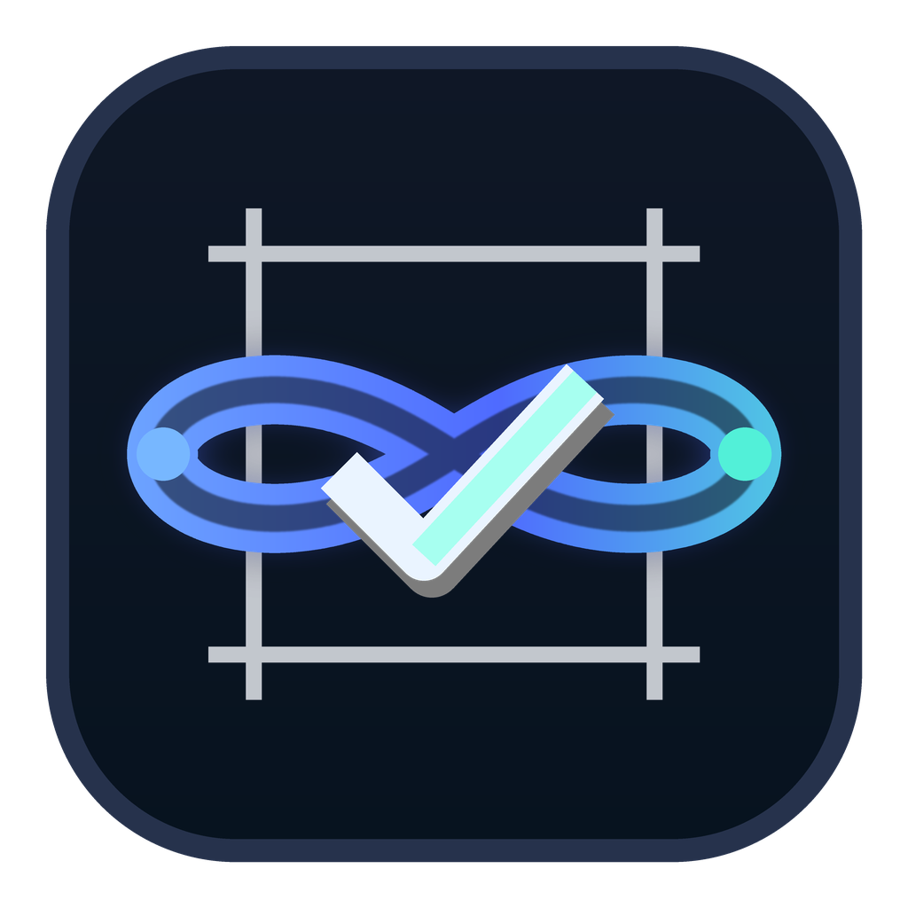

# Loop for Codex



Loop is an open-source Codex plugin for **loop engineering**: turning recurring project work into closed loops that discover work, triage it, act, verify, report, and remember what happened.

It now also supports a Claude-style `/loop` shape for prompt loops: give Loop an interval and a prompt, then let each scheduled firing run one bounded Codex pass with durable state and explicit stop conditions.

Instead of prompting a coding agent one task at a time, Loop helps you define reusable project-specific workflows with durable state and verification gates.

## What Loop Does

Loop v0.2 adds seven Codex skills:

| Skill | Purpose |
| --- | --- |
| `$loop-init` | Inspect a project and create `.loop/loop.yaml`, `.loop/loop.md`, and starter state files. |
| `$loop-design` | Turn a recurring task into a loop spec under `.loop/specs/`. |
| `$loop-goal` | Create a `/goal`-style done contract under `.loop/goals/`. |
| `$loop-agents` | Generate Codex maker/checker subagents under `.codex/agents/`. |
| `$loop-run` | Execute one manual pass of a saved loop. |
| `$loop-watch` | Draft a Claude-style recurring prompt loop or Codex Automation from an interval and prompt. |
| `$loop-audit` | Review loops for weak verification, repeated failures, unsafe scope, and cost risk. |

The core prompt loop shape is:

```text
Prompt -> Plan -> Act -> Observe -> Verify -> Record -> Decide continue/pause
```

The core project loop shape is:

```text
Discover -> Triage -> Act -> Verify -> Report -> Remember
```

## Why This Exists

Modern coding agents are most useful when they operate inside a harness:

- project knowledge
- clear scope
- explicit verification
- persistent state
- safe stop conditions
- repeatable workflows

Loop packages those patterns as reusable Codex skills.

## Loop Engineering Primitives

Loop is organized around the five primitives from modern loop engineering, plus durable state:

| Primitive | What Loop adds |
| --- | --- |
| Automations | `$loop-watch` turns interval/prompt input into one-pass recurring Codex Automation prompts. |
| Worktrees | `.loop/loop.yaml` records when worktree isolation is preferred and loop specs require it for edits. |
| Skills | The plugin ships focused Codex skills instead of one giant prompt. |
| Plugins/connectors | Project probing detects connector signals such as GitHub, CI, deploy config, MCP, and Codex app config. |
| Subagents | `$loop-agents` creates explorer, worker, and verifier agents so maker and checker are separate. |
| State | `.loop/runs.jsonl`, `.loop/NEXT.md`, `.loop/DECISIONS.md`, and `.loop/COMPREHENSION.md` preserve context outside one chat. |

## Installation

Clone this repository somewhere local:

```bash
git clone https://github.com/sanky369/loop-codex-plugin.git ~/plugins/loop
```

Then install it from Codex using your personal or local plugin marketplace flow.

If you maintain a local Codex marketplace file, add an entry like this:

```json
{
  "name": "loop",
  "source": {
    "source": "local",
    "path": "./plugins/loop"
  },
  "policy": {
    "installation": "AVAILABLE",
    "authentication": "ON_INSTALL"
  },
  "category": "Productivity"
}
```

For local development, you can also keep the repo at `~/plugins/loop` and validate it with:

```bash
python3 /path/to/plugin-creator/scripts/validate_plugin.py ~/plugins/loop
```

## Quick Start

Open Codex in a project repo and run:

```text
$loop-init Analyze this project and create a Loop profile.
```

Loop will create:

```text
.loop/
  loop.yaml
  loop.md
  goals/
  specs/
  automations/
  NEXT.md
  DECISIONS.md
  COMPREHENSION.md
```

Then design your first loop:

```text
$loop-design Create a daily CI triage loop.
```

Create a verifiable goal:

```text
$loop-goal Done means lint passes, unit tests pass, and the CI failure summary is linked in the run ledger.
```

Generate maker/checker subagents:

```text
$loop-agents Create Loop subagents for this project.
```

Run one pass manually:

```text
$loop-run Run the CI triage loop once.
```

Draft a recurring prompt loop:

```text
$loop-watch 5m check whether the deploy finished and report what changed
```

Other valid watch forms:

```text
$loop-watch check whether the deploy finished
$loop-watch 15m
$loop-watch
```

Those forms mean:

- interval plus prompt: use both values
- prompt only: use the default cadence
- interval only: use the default `.loop/loop.md` prompt
- bare command: use both defaults

Audit the loop setup:

```text
$loop-audit Check whether these loops are safe and useful.
```

## Example Loops

Useful first loops:

- **CI triage**: inspect failing checks, make narrow fixes, rerun the smallest relevant command, and report evidence.
- **Docs drift**: compare README/setup docs against actual project commands and patch stale instructions.
- **Frontend QA**: run browser-based checks after UI changes and capture verification evidence.
- **Test repair**: focus on one failing test, fix the cause, and rerun the relevant suite.
- **PR babysitting**: watch review comments or failing checks and prepare verified updates.
- **Deploy watch**: poll a deploy, summarize changes, and pause when the deploy is healthy or clearly blocked.

## Project Profile

`$loop-init` writes `.loop/loop.yaml`, which captures:

- project root
- git status support
- package managers
- frameworks
- install/lint/test/build/dev commands
- required verification checks
- goal contract directory
- connector signals
- subagent recommendations
- worktree policy
- write boundaries
- run ledger path
- default prompt path
- automation prompt path
- durable state files
- recommended loops

Other Loop skills use this file as the project contract.

## Run State

Loop records run history in:

```text
.loop/runs.jsonl
```

Each run can record:

- timestamp
- loop name
- status: `passed`, `failed`, `noop`, `blocked`, `paused`, or `completed`
- prompt
- cadence
- summary
- verification evidence
- next action
- pause reason

Loop also creates markdown state files:

```text
.loop/NEXT.md
.loop/DECISIONS.md
.loop/COMPREHENSION.md
```

These make loop output reviewable by the human engineer. The run ledger says what happened; the markdown files capture what to do next, why decisions were made, and what the engineer needs to understand.

## Safety Model

Loop starts conservative:

- read-only discovery before edits
- worktree isolation preferred for Git repos
- no deploys, deletes, billing changes, secret changes, or external sends without explicit human approval
- success requires verification evidence
- edit-capable scheduled loops should have a goal contract and an independent verifier
- each scheduled firing is one bounded pass
- repeated failures should pause instead of retrying forever
- loops should record comprehension notes so speed does not turn into understanding debt

Loop is designed for **closed loops**, not blind autonomy.

## Repository Structure

```text
.codex-plugin/plugin.json
skills/
  loop-agents/SKILL.md
  loop-init/SKILL.md
  loop-design/SKILL.md
  loop-goal/SKILL.md
  loop-run/SKILL.md
  loop-watch/SKILL.md
  loop-audit/SKILL.md
scripts/
  loop_agents.py
  loop_goal.py
  project_probe.py
  loop_prompt.py
  loop_state.py
assets/
  default-loop.md
  goal-template.md
  loop-engineering-checklist.md
  loop-spec-template.md
  verification-template.md
  safety-policy-template.md
```

## Development

Run syntax checks:

```bash
python3 -m py_compile scripts/project_probe.py scripts/loop_prompt.py scripts/loop_state.py scripts/loop_agents.py scripts/loop_goal.py
```

Probe a project without writing files:

```bash
python3 scripts/project_probe.py --root /path/to/project --json
```

Write a Loop profile and default prompt:

```bash
python3 scripts/project_probe.py --root /path/to/project --write
```

Parse a watch prompt:

```bash
python3 scripts/loop_prompt.py parse "5m check deploy status"
```

Generate Loop subagents:

```bash
python3 scripts/loop_agents.py --root /path/to/project --write
```

Create a goal contract:

```bash
python3 scripts/loop_goal.py --root /path/to/project --title "CI triage done" --condition "Lint and tests pass, and CI findings are recorded" --check "npm test" --write
```

Summarize run history:

```bash
python3 scripts/loop_state.py summary --root /path/to/project
```

## Status

Loop is v0.2.0 and intentionally skills-first. It does not run a daemon or always-on background service. Recurrence should go through Codex Automations so scheduling, permissions, reporting, and user control stay native to Codex.

Each scheduled firing is designed to be one bounded Codex pass: inspect, act if appropriate, verify, record state, and decide whether to continue, pause, or stop.

## License

MIT
